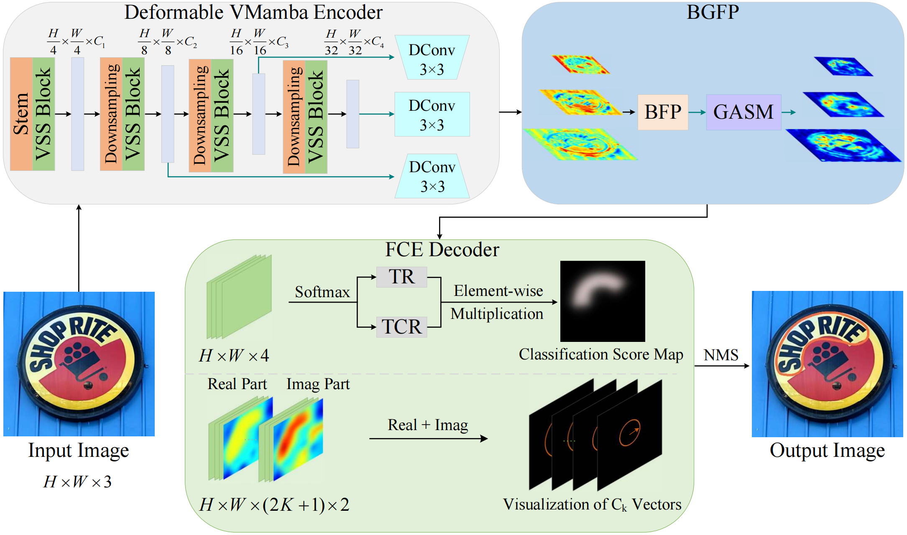

# GDText-VM
GDText-VM: An Arbitrary-Shaped Scene Text Detector Based on Globally Deformable VMamba


## News
- (2023/11/20) GDText-VM 

## Introduction

In this paper, we proposed a novel method for efficient and accurate arbitrary-shaped scene text detection, termed GDText-VM, to improve the efficiency and accuracy of text detection.

<div align="center">
 
</div>

The overall network architecture diagram will be uploaded after publication

## Installation

First, clone the repository locally:

```shell
git clone https://github.com/radish512/GDText-VM.git
```

required:

PyTorch 1.1.0+

torchvision 0.3.0+

pip install -r requirement.txt

## Dataset
Please refer to [dataset/README.md](dataset/README.md) for dataset preparation.

## Training

```shell
CUDA_VISIBLE_DEVICES=0,1,2,3 python tools/train.py ${CONFIG_FILE}
```
For example:
```shell
CUDA_VISIBLE_DEVICES=0,1,2,3 python tools/train.py configs/GDText-VM/vssm_bfp_gasm_1200e_ctw1500.py
```

## Testing

```shell
python tools/test.py ${CONFIG_FILE} ${CHECKPOINT_FILE}
```
For example:
```shell
python tools/test.py configs/GDText-VM/vssm_bfp_gasm_1200e_ctw1500.py checkpoints/checkpoint.pth
```

## Citation

Please cite the related works in your publications if it helps your research:

## License

This project is released under the [Apache 2.0 license](LICENSE).
